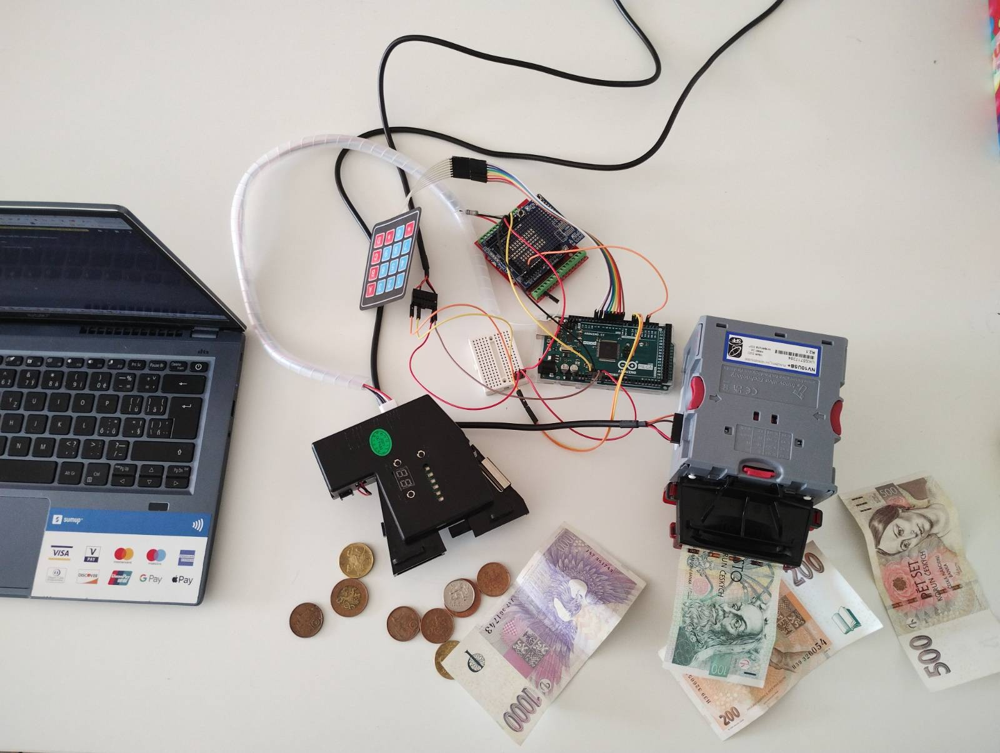
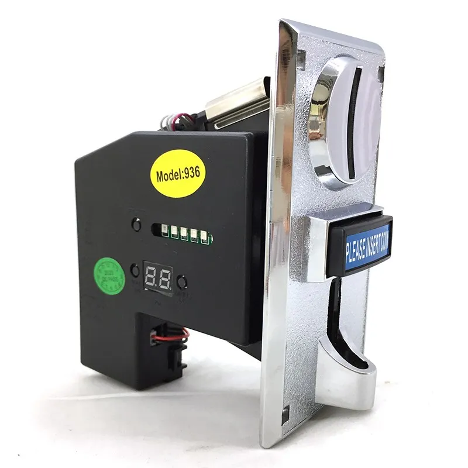

# **VexlATM**
je automat, skrze který si můžete pořídit Bitcoin prostřednictvím Lightning Network (LN). Ačkoliv se podobá projektům jako Bleskomat či Fossa, byl vyvinut zcela nezávisle. Bleskosvod je zaměřen na jednoduchost a přístupnost. Vzhledem k tomu, že jsem úplný začátečník v programování, díky tomu je replikace projektu snadná a rychlá.

 #### Výhody projektu
 - jednoduchost, lze rychle pochopit kód do 10 minut
 - arduino UNO R3, ESP32, (Arduino Mega, Giga)
 - snadná replikovatelnost
 
> [!IMPORTANT]  
> Projekt ještě nění dokončen! -> Zde je jen pár testovacích kódů pro jednotlivá zařízení, ještě to dávám celé dokupy. 

# HW
- Nextion Intelligent, (NX4827P043-011C-Y, Enhanced NX4827K043) !minimum FLASH 32M
- NV10-USB-plus
- acceptor-936
- arduino Uno R1 / Giga

# Externí návody
- https://randomnerdtutorials.com/nextion-display-with-arduino-getting-started/
- https://docs.arduino.cc/tutorials/giga-r1-wifi/giga-wifi#web-server-ap-mode
- https://nextion.tech/editor_guide/
- https://nextion.tech/instruction-set/
- https://forum.arduino.cc/t/cant-get-nextion-to-talk-to-arduino-mega-and-vice-versa-solved/671785/5
- 

## NV10-USB-plus
protokol POS
 * Acceptor NV10  - Arduino Mega 2560
 * NV10 PIN 1 (RS232) Tx <-> Arduino Serial3 Rx 15
 * NV10 PIN 5 (RS232) Rx <-> Arduino Serial3 Tx 14
 * NV10 Top tier of pins - TOP PIN 1 -> Rx 15 TOP PIN 3 -> Tx 14
 * NV10 PIN 15 (top) <-> Arduino Vin - 12 V   
 * NV10 PIN 16 (down) <-> Arduino GND)  
 * NoteAcceptor.write(184);  //Acceptor enabled
 * NoteAcceptor.write(185); //Acceptor Disabled
 * NoteAcceptor.write(170);  //Enable serial escrow mode
 * NoteAcceptor.write(191); // Enable escrow timeout
 * NoteAcceptor.write(182); //Status
 * NoteAcceptor.write(173); //Decline
# acceptor-936-mincovnik-arduino-czk

## Mincovník "acceptor-936" 

 Po vhození přednastavené částky se vypíše zpráva a může se například sepnout relé či načíst webová adresa - GET uloží honotu za pomocí PHP

> [!NOTE]  
>Tento kód funguje tak, že při detekci mince se aktivuje přerušení (funkce preruseniPriVhozuMince), což zvýší celkový počet detekovaných mincí. V hlavní smyčce loop kontrolujeme, zda uplynul dostatečný čas od poslední detekce a zda současný zůstatek dosáhl požadované ceny. Pokud ano, posíláme zprávu a vynulujeme současný zůstatek a celkový počet detekovaných mincí.

> [!IMPORTANT]  
> Arduino UNO R3 Wifi, Arduino UNO R4 Wifi: musíte napájet 12V kvůli mincovníku (nestačí USB) 

### Zapojení mincovníku 🏴
- (Mincovník) DC 12 (červený drát)  --> V in (arduino)
- (Mincovník) GND (černý drát)      --> GND (arduino)
- (Mincovník) COIN (bílí drát)
  - --> digital pin 2
  - --> REZISTOR 10KΩ --> 5V
  

> [!WARNING]  
> Přerušte drát a vložte ------REZISTOR 10KΩ-----------  

### Nastavení mincovníku "acceptor-936" 💜

#### Základní nastavení 

Nastavení mincovníku vyvoláte přidržením tlačítek ADD + MINUS

H,P,F opakujte podle E nastavených počtu druhů mincí:

- **E** počet druhů mincí které budou akceptovány
- **H** počet vzorků mincí
- **P** počet impulsů
- **F** přesnost snímání - doporučeno výrobcem: 8

#### Impulsy - P
- 5 impuls = 5 CZK
- 10 impuls = 10 CZK
- 20 impuls = 20 CZK
- 50 impuls = 50 CZK

#### Párování - snímání mincí  SET
- Stiskněte **SET 2x**
- Vhoďte 5 CZK do mincovníku (opakujte podle H) 
- Stikněte **SET 1x**
- Vhoďte 10 CZK do mincovníku (opakujte podle H)
- Stikněte **SET 1x**
- Vhoďte 20 CZK do mincovníku (opakujte podle H)
- Stikněte **SET 1x**
- Vhoďte 50 CZK do mincovníku (opakujte podle H)

#### Alternativní impulsy pro EURO
- 2 impuls = 10 cent
- 4 impuls = 20 cent 
- 10 impuls = 50 cent
- 20 impuls = (100 cent) 1 EUR
- 40 impuls = (200 cent) 2 EUR

Výslednou částku vynásobte: **soucasnyZustatek * 5** = 280 cent 

### Zdroje:
https://docs.arduino.cc/tutorials/uno-r4-wifi/wifi-examples

###  Nextion Intelligent
print "b0"
page page1

